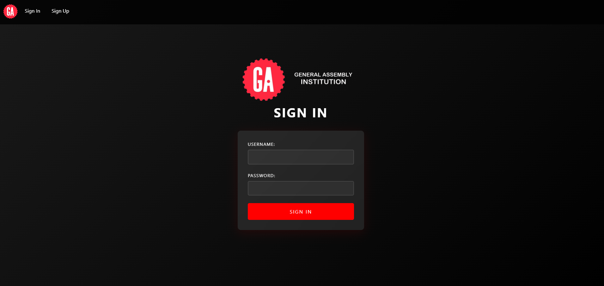

# Institution Database
This is a managment system for intitutions and university, assisst in ernollment process and tracking the grade.

## Getting started
To access the web you [press here](https://institution-database.onrender.com)

## Technologies used
- HTML
- JavaScript
- CSS
- Mongoose
- Express
- Dotenv
- Ejs

## Next steps
1. Add extra control the the users and allow different type of user such as student or tutor.
2. Simplify the search using course code.
3. Add extra theam for light and drak mode. 
